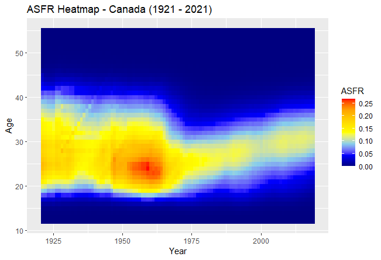

```{r}
```

The above ASFR heatmap shows that there exists a general upward trend in the age at birth, i.e, Canadians are having children later and later in their lives. Additionally, it can be seen that there exists a downward trend in the fertility rate, even in the "prime" years.

In the 1950-1970 period, Canada saw a lot of births, corresponding with the Baby Boomers phenomenon. In that timeframe, the 20-25 age window is seen as having the highest fertility rate.

Interestingly, Canada saw a decline in fertility rates around the year 2000.
