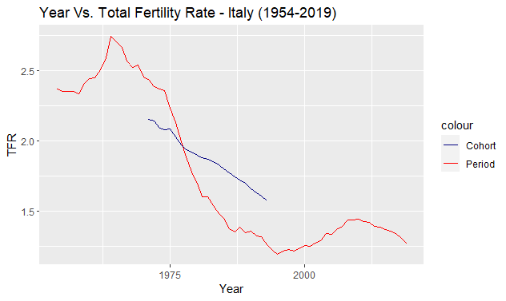

```{r}
```

The above plot presents the change in Total Fertility Rate and Cohort Total Fertility Rate in Italy, in the 1954-2019 period. It is seen that there is a large drop in fertility rates. The Mean Age at Childbearing was computed to have peaked around 1975 at 32 years of age. However, in this plot a value of 29 was taken as a placeholder to account for the lag.

Italy's fertility rates are falling heavily and seem to be much below the steady state rate.