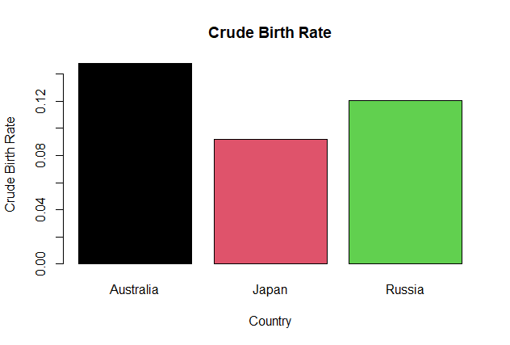

```{r}

```

The above barplot displays the magnitude of births with respect to the population of the country - the crude birth rate. Here, the midyear population is used as a substitute for real population size.

Australia is found to have a CBR Of approximately 0.148, while Japan and Russia are found have CBR of 0.092 and 0.121, respectively.