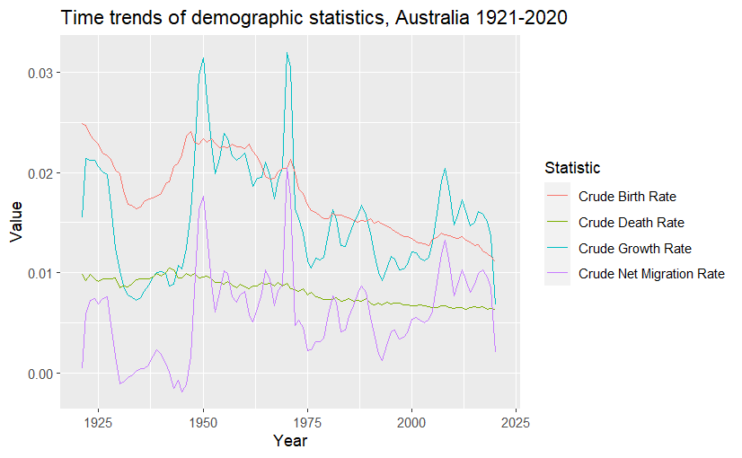
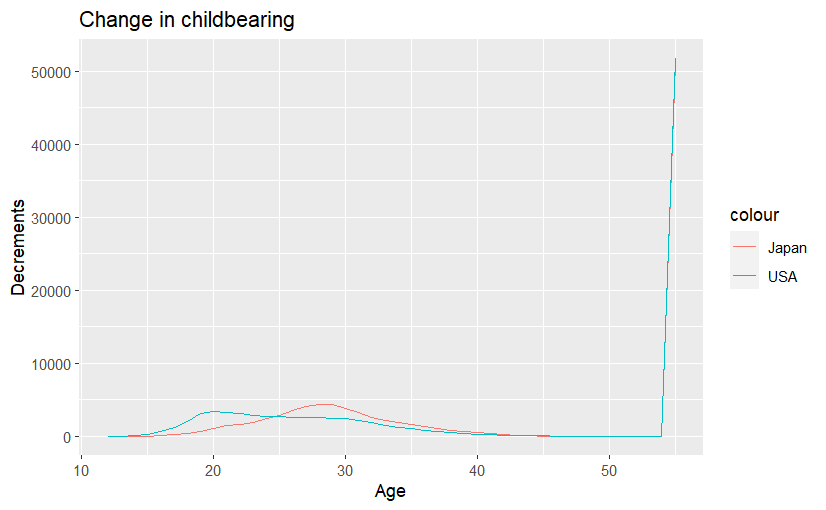
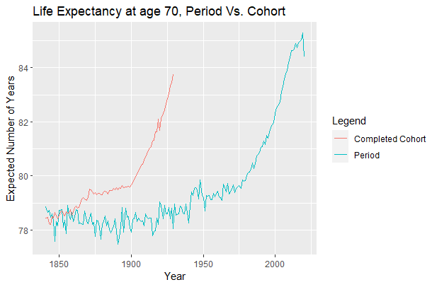

### Question 1

1.  a

| Observed Net Migration | Year | Value    |
|------------------------|------|----------|
| Minimum                | 1945 | -13376.0 |
| Maximum                | 2008 | 281158.7 |

At the end of world war, in 1945, Australia saw very little immigration and large numbers of emigration. However, between 1945 and 1965 a large growth in net migration was observed, corresponding to the Post War Immigration Drive by the government.

In the 2000s, a large upward growth in migration was observed, which reached its peak in 2008. This growth corresponds to the immigration of skilled laborers and students. However, possibly due to the 2008 financial crisis, there was a rapid decline in migration after that.

1.b 

1.c The above plot displays clear trends in demographic statistics that correspond to global trends.

-   Drops in Birth, Growth, and Migration rates during the second World War, followed by large growths immediately after, i.e., arrival of the Baby Boomers and post war development.

-   A clear drop in Crude Birth Rate over the years is observed.

-   In the late 1960s, a large number of immigrants moved to Australia, with the Crude Net Migration Rate peaking in 1970.

-   Towards the right extreme of the time axis, a rapid decline in Crude Net Migration Rate, and subsequently Crude Growth Rate, is seen due to border lock-downs prompted as a response to COVID19.

-   The future of Australian population is in question due to falling birth rates - a CBR of 0.011 was observed in 2020, much lower than the 0.021 considered necessary to maintain a population (migration not considered). This trend will continue, possibly exacerbated by the effects of COVID19.

-   Possibly due to advances in healthcare and general improvements in living quality, a drop in CDR is observed. This trend is likely to continue into the future as medical technology and accessibility improve.

-   Inflection points around the time of immigration policy changes can be observed in the plot. As such, following the lifting of COVID19 restrictions, one can expect a growth in CNMR in the future.

### Question 2

2a

The Lx variable that captures the number of survivors is analogous to the number of childless women at each age level.

The above graph shows that on average, Japanese women have their first child later in life than their American counterparts.

2.b

The decrement dx here is analogous to the number of births at each age level, starting at the radix population of 100000.

2.c

|             | USA      | Japan    |
|-------------|----------|----------|
| TFR         | 0.65831  | 0.671    |
| MAC (years) | 27.36889 | 30.15729 |

2.d

The life expectancy derived using the life table can be considered the age at which a woman has her first child. Furthermore, the derived remaining number of years can be considered a better indicator than MAC for women to plan their families.

### Question 3

3.a

Large drops in period life expectancy at birth in the UK and Wales is seen during the world wars. This could be due to the disproportionate mortality among young men. Correspondingly, one can see a drop in life expectancy at birth in the Cohort plot as well, with boys born in the late 1800s and early 1900s (the cohort that would be of fighting age during the wars)

There also exists a general positive trend life expectancy, possibly linked to improvements in healthcare and general quality of life.

3.b

+---------------+----------------------------------------------------------------------------------------------------------------------------------------------+-----------------------------------------------------------------------------------------------------------------------------------------+
|               | Cohort Life Expectancy                                                                                                                       | Period Life Expectancy                                                                                                                  |
+===============+==============================================================================================================================================+=========================================================================================================================================+
| Advantages    | -   It accounts for time variability in influencing factors such as improvements in healthcare.                                              | -   Period life expectancy allows for the comparison of metrics at a given point in time.                                               |
|               |                                                                                                                                              |                                                                                                                                         |
|               |                                                                                                                                              | -   For example, it would be possible to look at the life expectancy in a country across years, or across countries in a specific year. |
|               |                                                                                                                                              |                                                                                                                                         |
|               |                                                                                                                                              | -   There is no subjectivity in calculation.                                                                                            |
+---------------+----------------------------------------------------------------------------------------------------------------------------------------------+-----------------------------------------------------------------------------------------------------------------------------------------+
| Disadvantages | -   Projected life expectancy must be used for current cohorts, i.e., accurate life expectancy can be calculated only for completed cohorts. | -   It is assumed that a person goes through all ages in one specific time period.                                                      |
|               |                                                                                                                                              |                                                                                                                                         |
|               | -   Projections can be subject to the expertise and assumptions made by the researcher.                                                      |                                                                                                                                         |
|               |                                                                                                                                              |                                                                                                                                         |
|               | -   Calculated statistics would need to be displaced in time to match with current living population.                                        |                                                                                                                                         |
+---------------+----------------------------------------------------------------------------------------------------------------------------------------------+-----------------------------------------------------------------------------------------------------------------------------------------+

3.c

The expected number of remaining years for a person at 70 is seen to be increasing, almost doubling from about 8 years to about 14. This growth is greater in the period graph due to higher life expectancy among the younger population.

The stark difference between graph 3.a and 3.c lies in the life expectancy in the 19th century. The average person had a life expectancy at birth of about 40 years. However, those who live long enough to be 70 years old are already outliers in the population and can be expected to live a few more years on average.
