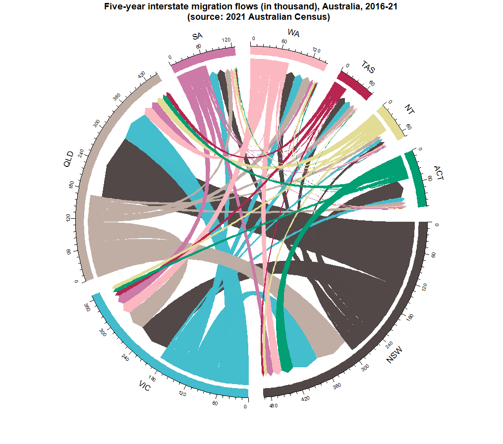

```{r}

```

The above plot displays the migration trends from each state to the other. It is observed that the largest group of migrants move from New South Wales to Queensland. NSW has the largest net emigrants, with Victoria and Queensland following it. It is also observed that more people immigrated to Tasmania than emigrated from there.
