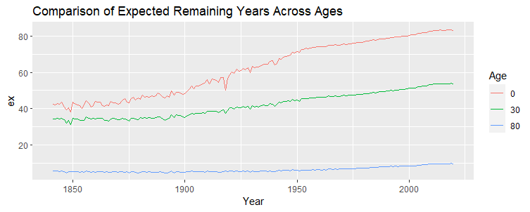

```{r}
```

The above plot presents the expected remaining number of years of life for people of Australia at the ages of 0 (Life expectancy at birth), 30, and 80. It is observed that there is a significant increase in the life expectancy at birth across the years. However, it can also be seen that the expected remaining years for the older population has not increased substantially.
