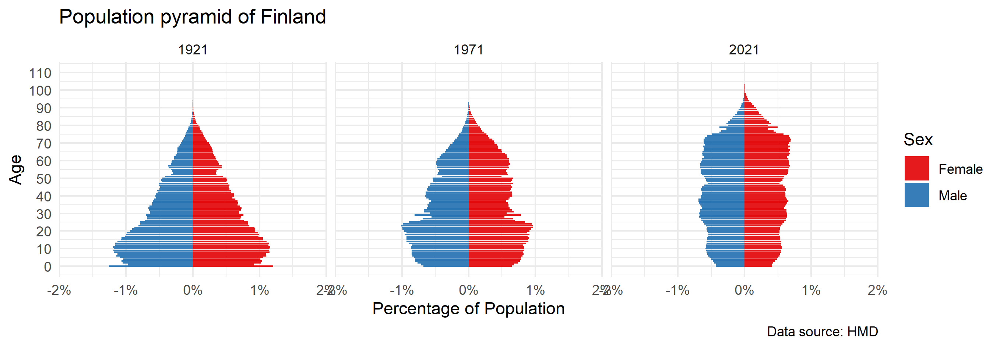

```{r}
```
The above graphic presents the change in population composition in Finland between 1921 and 2021. A reduction in the fertility rate can be observed, as the number of infants (Age = 0) as a proportion of the total population is seen to be reducing. However, the population composition of Finland might be stabilizing in the 21st century.

It can also be observed that the ceiling of age is increasing.

