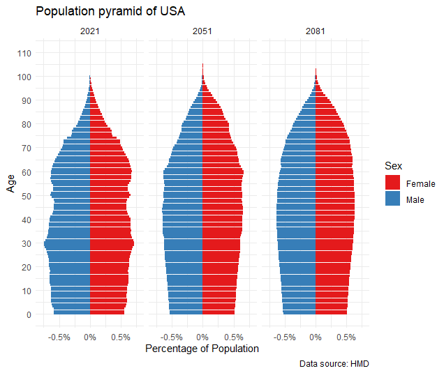

The above graphic presents projections of USA's population over 60 years. It can be seen that the distribution stabilizes over time, with a lot variation by age being smoothed out. It is also seen that the aged population starts to wane later and later over the years.

This can be interpreted as the effect of regularizing mortality rates. There are fewer deaths throughout the lifetime, with most people living longer.
